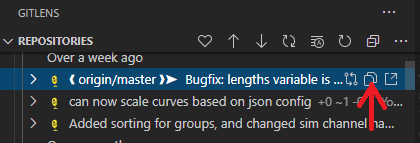
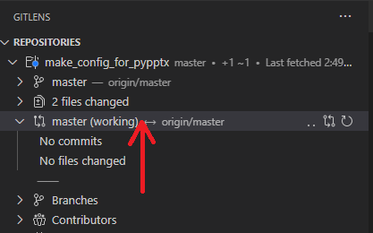
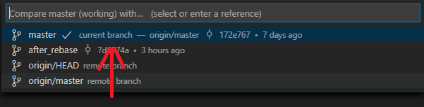
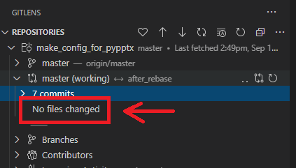
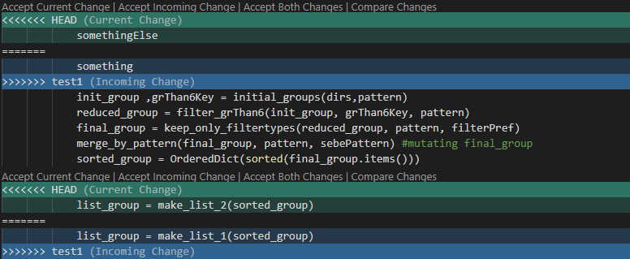

# Table of contents

- [Table of contents](#table-of-contents)
- [Basics](#basics)
- [Basic overview of git structure](#basic-overview-of-git-structure)
  - [Branches](#branches)
    - [Use cases of branches](#use-cases-of-branches)
      - [Making a new branch out of a previous commit](#making-a-new-branch-out-of-a-previous-commit)
      - [Making a branch to save work before a rebase or reset](#making-a-branch-to-save-work-before-a-rebase-or-reset)
      - [Adding a single commit from another branch to you current branch](#adding-a-single-commit-from-another-branch-to-you-current-branch)
      - [Merging changes from one branch to another](#merging-changes-from-one-branch-to-another)
  - [Remote tracking branches](#remote-tracking-branches)
    - [Using remote tracking branches](#using-remote-tracking-branches)
    - [Hard reset with remote tracking branches](#hard-reset-with-remote-tracking-branches)
- [Basic commands](#basic-commands)
- ["Advanced" git commands](#advanced-git-commands)
  - [Changing commit history: interactive rebase](#changing-commit-history-interactive-rebase)
    - [Before rebasing](#before-rebasing)
    - [Interactive rebase](#interactive-rebase)
    - [After the rebase](#after-the-rebase)
  - [Adding further changes to last commit](#adding-further-changes-to-last-commit)
  - [Discard last n commits](#discard-last-n-commits)
- [Set default editor](#set-default-editor)
  - [Set default merge tool and diff tool](#set-default-merge-tool-and-diff-tool)
- [Merge conflicts](#merge-conflicts)

# Basics

Git is a distributed version-control system, that lets you track changes in the files
of your project. In this overview we will look at most of the basic
features of git and some advanced ones aswell. Git is command-line
driven, but there are also some GUI applications for working with it.
We will mostly look at only the command-line commands for working with git.

The distributed in the distributed version-control system means, that everyone
working on a project has a full-fledged copy of the history and files of the
project. Therefore, if something goes wrong with the remote server, its not a big
deal, because everyone has everything locally aswell.

Git is not just useful to collaborate with people on a project,
but it can also be used to just track your own project, that you
work on single handedly. If you are doing this, working solo on a project,
everything is the same as working on a bigger project with multiple people.
This is because git is a distributed version-control system, an it doesn't
really care how many people contribute to a project.

Therefore, I strongly advise that you track all of you scripts/project using git.
When you make a new script, the first thing that should come to your mind is:

```conf
$ git init
```

# Basic overview of git structure

In git, you track your projects using a repository. There are two types of repositories. One is bare,
the other one is local (non-bare). You use a local repository to track you files locally, and then you push your
changes to the bare repository. The local repository is basically a folder named .git in your project. You initiate this
.git folder using the following command:

```conf
$ git init
```

After you do this, your .git folder is created, and it is ready to track the changes that happen in your project.
You can track your changes by committing them to your local repository. A commit is a set of changes in some files,
together with a commit message. The commit message should state what happened with these files since they have been last
committed. A commit consists of two steps. First, you need to specify which files you wish to include in your commit, then
you need to commit these files. You specify the files that need to be committed by using the **git add** command. Using this
command you move files to the staging area. The files that are in the staging area will be included in your commit.
As you see you can have several files in a single commit. This is useful, because you should make commits, that
in some sense have a coherent meaning. This usually means that you modify more than one file, but the update in your project
can be stated with a single sentence.

After you staged you files, you should commit them using the **git commit** command.
After you made the commit, you have saved the changes in your files to your .git repository.
This is great, because after this point, even if you mess something up, you can always revert to this
version of your project.

For example, if you delete your tracked file from you file system permanently,
you can still get back the contents of that file from your git repository, because the last version of your
project was saved inside the .git folder with your commit.  
Also, when you start changing your file you will be able to see what is a new change, and what was already present
in the last commit. Modern text editors have some sort of support for git. For example, if you use VS Code, on the left hand side of your
text area, next to the line numbers, the editor has a line with different colors, that state what has happened to that line. A green
line indicates something that is completely new, a blue line indicates something that was present before, but got changed, and a
red mark states that something got deleted from there.

If you work together with people on a project, then you need a remote repository, where you can share
your work. A remote repository is a bare repository, that contains the history of your project. You can create a bare repository
with the following command:

```conf
$ git init --bare
```

The remote repository will be the place that you push your changes to, and the place that you pull from.
Pushing means, that you upload your commits to the remote repository, so people can access them. Pulling means,
that you download other peoples changes to your local repository, so you can work on the freshest version of
the project. To add a remote repository to your project (if you don't already have one) use the following command:

```conf
$ git remote add origin {URL}
```

where {URL} is the URL to your remote (bare) repository. This can be a http
link, an ssh address, or just a path in your file system. After doing this, you can push to and pull from this remote branch
with the following commands:

```conf
$ git pull origin master
$ git push origin master
```

The first command pulls data from the origin remote repo's master branch to the current branch that is checked out.
See more on branches in [Branches](#branches)
The second command pushes data from your local master branch to the remote master branch. If you wish to push from
your local *some_other_branch* to the remote master branch, do this instead:

```conf
$ git push origin some_other_branch:master
```

You can only push changes to the remote repo, if your local repo has
all the commits that is already present in the remote repo. This is because otherwise, the commit history / structure
of your local repo and remote repo would differ, and that is not permitted. Therefore, you first need to pull in the changes
from the remote repo, and after you pulled in these changes, can you push your changes to the remote repo.

When you pull the changes from the remote repo, a merge conflict can occur. See more on this in [Merge conflicts](#merge-conflicts).

## Branches

A branch in git is basically an independent line of development. It contains a series of commits chained together.
When you make a commit, then you update the state / history of the branch that is checked out. At any point in time,
you can make a new branch from an existing one with the following command:

```conf
$ git branch name_for_your_new_branch
```

You can step into this branch (checkout the branch) with the following command:

```conf
$ git checkout name_for_your_new_branch
```

And you can step back to the previous one with (considering, that your previous branches name was *master*):

```conf
$ git checkout master
```

You can see what branches exist in your project, and what is currently checked out with:

```conf
$ git branch
```

What is currently checked out will have a * before its name, and in most terminals, it will be colored to green aswell.

**IMPORTANT**:  
When you use the **git checkout** command, the files in your file system are changed. Your files will be reverted,
to look like they did, when you last committed on that branch. If you switch back to another branch, your files will
be (obviously) changed again, to look like they did when you last committed on that branch.

When you make a new branch, the line of development, and all files in your project are completely the same
as in the branch that was checked out, when you ran the **git branch** command. However, when you make a new commit
now in your new branch, only that branch will be updated, that is currently checked out. Therefore, branches can be used
to make changes in your project, without affecting your main line of development. The main line of development is usually found
in the *master* branch.

A branch can be deleted with the following command:

```conf
$ git branch -d name_of_you_branch
```

By default, git will only let you delete your branch, if it is fully merged. This way, if you
delete your branch, you will loose no information, because every commit is already present in some
other branch. However, if you wish to delete your branch anyway, you can do so, by capitalizing the d:

```conf
$ git branch -D name_of_you_branch
```

### Use cases of branches

Branches are great so lets see some examples of using them.

#### Making a new branch out of a previous commit

You can checkout not just branches, but commits aswell. For this you need the commit ID, which can be found by running
the following command (hit q to exit the log):

```conf
$ git log
```

The output will consists of similar entries:

```conf
commit 172e767c46c08174c63b6b54e498301470d291b2 (origin/master, master)
Author: Tam<C3><A1>s Rig<C3><B3> <tamas.rigo@econengineering.com>
Date:   Thu Sep 10 10:01:05 2020 +0200

    Bugfix: lengths variable is calulcated after filtering groupings
```

The stuff after the *commit* is the commit ID, in this case, it is: 172e767c46c08174c63b6b54e498301470d291b2.
You can also copy this from VS Code's Gitlens extension, by clicking here:



Running the following command will change you files in your working directory to be just like they were,
when you made the commit, and then it will make a new branch and step into it:

```conf
$ git checkout 172e767c46c08174c63b6b54e498301470d291b2
$ git branch new_dev_branch
$ git checkout new_dev_branch
```

If you now make commits, then your work will be based off of the commit that you checked out.
So as you see, using this technique you can make a new line of development from a previous
state of your project.

#### Making a branch to save work before a rebase or reset

You can make a new branch to save your work before you do a rebase, or a reset. This is useful,
because in case you mess something up, you can easily revert back to the original version. So before
doing somethin risky, first do:

```conf
$ git branch backup_to_be_safe
```

#### Adding a single commit from another branch to you current branch

You can add a single commit from one branch to another, using the cherry pick command.
For this, you need the commit ID of the commit, that you wish to integrate in your branch.
The following commands, will add the commit with id:172e767c46c08174c63b6b54e498301470d291b2
to the branch named: *master*.

```conf
$ git checkout master
$ git cherry-pick 172e767c46c08174c63b6b54e498301470d291b2
```

#### Merging changes from one branch to another

It is quite common, to have the main line of development on the master branch, and your current
development on some other branch, that is based off of a commit from the master branch. You do your work
in this development branch, and after you are done, and everything looks good, you migrate these changes into
the master branch with a merge. Merging the changes from the branch *dev* to the branch *master* can be done so:

```conf
$ git checkout master
$ git merge dev
```

See: [Merge conflicts](#merge-conflicts) on how to resolve merge a conflict, in case there is one.

## Remote tracking branches

You can always inspect the current state of a remote branch without actually pulling in the changes from the remote repo.
This can be done with the **git fetch** command and with the so called remote tracking branches. A remote tracking branch, is 
a branch in your local repository. The difference between a remote tracking branch, and a normal branch is, that you can not
modify a remote tracking branch with commits explicitly. They are automatically modified when you push, pull or fetch from your
remote repository. When you push, pull or fetch, the remote tracking branch gets updated to the current status of the remote repository's
branch. Thats why they are called remote tracking branches, because they track your remote branches current status. A remote tracking branch
has always a slash (/) in its name. The stuff before the / is the name of the remote repository and the stuff after the / is the branch that it
tracks. For example, the following can be a remote tracking branch: *origin/master*.

You can list your remote tracking branches with:

```conf
$ git branch -r
```

Or you can list all of your branches with:

```conf
$ git branch -a
```

If you use the **git branch -a** command, then the remote tracking branches will have a *remotes/* string before them.

**IMPORTANT**  
The remote tracking branch is not actually the remote repository. It is merely a local branch with special properties.

### Using remote tracking branches

A common theme of using remote tracking branches is to first use **git fetch --all** to update your remote tracking branches,
and then to compare your local branch with its corresponding remote tracking branch. So for example:

```conf
$ git fetch --all
$ git diff master origin/master
```

What git pull does is actaully a fetch followed by a merge:

```conf
$ git checkout master
$ git fetch origin
$ git merge origin/master
```

Is the same as:

```conf
$ git checkout master
$ git pull origin master
```

### Hard reset with remote tracking branches

It is also common, to do a hard reset with a remote tracking branch. A hard reset wipes your whole commit history, throws away
every staged and unstaged changes, and makes your branch exactly the same as the one that you specified. As you can see, a hard reset
has a destructive nature, and should only be done, when you know for sure, that you want to throw away everything in your local branch,
and make it look just like your remote branch.

Before doing a hard reset it is wise to first create a new branch from your current one, to save your work just in case you might
need it later:

```conf
$ git checkout master
$ git branch my_saved_work
```

After this you can make a hard reset. The following makes your local master branch just as the remote's master branch:

```conf
$ git checkout master
$ git fetch --all
$ git reset --hard origin/master
```

The **git fetch** command before the **git reset --hard** is very important. If you don't do this, then your origin/master branch will not
be updated before the reset happens, and it will not be resetted to the current state of the remote repository's master branch. It will be
resetted to the state it was in, when you last pulled pushed or fetched from it.

This command is useful for example after you completely rebase your project (for example to rename old commit messagess), and you push forcefully
to the remote repo. After you pushed forcefully (with **git push -f**), your colleages will need to update their project with a hard reset.

# Basic commands

Initialize an empty repository, to start tracking your project:

```conf
$ git init
```

Initialize a bare repository, where you can push your local repository to:

```conf
$ git init --bare
```

Display the status of you current project. Shows which files are in the staging area
ready to be committed, shows which files have been modified, and several other information
aswell.

```conf
$ git status
```

Get a quick look at the commit history of your project. Using the --oneline option
the commits are listed line by line, making the log easier on the eye. However,
there are a lot of optios for this command, so see the official documentation if you
need something special.

```conf
$ git log --oneline
```

Add *name_of_file* to the staging area.

```conf
$ git add name_of_file
```

Add every file to the staging area.

```conf
$ git add -A
```

Add new files and modified files to the staging area, but don't add deleted ones.

```conf
$ git add .
```

Remove *name_of_file* from the staging area.

```conf
$ git reset name_of_file
```

Remove all files from staging area

```conf
$ git reset
```

Commit your changes

```conf
$ git commit -m "your commit message"
```

If you commit without the -m argument, git will open your default text editor
and will ask you to specify your commit message there. After saving and closing
this file, the commit will be made. See: [Set deafult editor](#set-default-editor)
to set your default editor for git.

Add a remote repository named origin to your local one, so you can push pull data
from your local repository to / from the remote repository. The name origin can be something else
aswell, it will be used later on to refer to this remote branch. The convention is to name it origin.

```conf
$ git remote add origin {URL}
```

where {URL} is the URL to your remote (bare) repository. This can be a http
link, or an ssh address.

View your remote repositories:

```conf
$ git remote -v
```

# "Advanced" git commands

## Changing commit history: interactive rebase

### Before rebasing

Before doing the rebase make a new fresh branch from your branch
that you wish to rebase:

```conf
$ git checkout -b some_new_branch_name
```

You should do your rebase here, because if something goes wrong, you
will not loose your original branch, and you can switch back to it,
delete the new branch, make another one from the original, and try again.

Changing the commit history, commit messages, and squashing more commits
into one commit can be done with an interactive rebase:

### Interactive rebase

```conf
$ git rebase -i HEAD~{number}
```

where {number} is a number that specifies how many commits you wish to
edit. For example, the following command will list the last 3 commits:

```conf
$ git rebase -i HEAD~3
```

What you will see after this command is something like this:

```conf
pick fedce4f Added sorting for groups, and changed sim channel names for component test
pick 5a69ac4 can now scale curves based on json config
pick 172e767 Bugfix: lengths variable is calulcated after filtering groupings

# Rebase 61230df..172e767 onto 61230df (3 commands)
#
# Commands:
# p, pick <commit> = use commit
# r, reword <commit> = use commit, but edit the commit message
# e, edit <commit> = use commit, but stop for amending
# s, squash <commit> = use commit, but meld into previous commit
# f, fixup <commit> = like "squash", but discard this commit's log message
# x, exec <command> = run command (the rest of the line) using shell
# b, break = stop here (continue rebase later with 'git rebase --continue')
# d, drop <commit> = remove commit
# l, label <label> = label current HEAD with a name
# t, reset <label> = reset HEAD to a label
# m, merge [-C <commit> | -c <commit>] <label> [# <oneline>]
# .       create a merge commit using the original merge commit's
# .       message (or the oneline, if no original merge commit was
# .       specified). Use -c <commit> to reword the commit message.
#
# These lines can be re-ordered; they are executed from top to bottom.
#
# If you remove a line here THAT COMMIT WILL BE LOST.
#
# However, if you remove everything, the rebase will be aborted.
#
# Note that empty commits are commented out
```

If you run your rebase, and see a different commit history than what you see in
your git log, then this is most likely because of merge commits. These are
treated somehow separately when rebasing. If you wish to see and work with
the commit history as you see when typing **git log** then you need to use the
--rebase-merges flag:

```conf
$ git rebase -i --rebase-merges HEAD~3
```

When using this, the *label onto* and *reset onto* lines should not be touched or
moved.

The comments in the description of the rebase file describe what one can do. I will give
a brief description of the most useful ones, and the ones that I have used
before.

* pick uses the commit, and does not change its contents
* reword uses the commit, and lets you edit the commit message of that commit
* fixup (or squash) will use the commit and will meld this commit into the previous commit.
  If multiple fixups follow each other, than all of these are melded into the
  first one that is a pick or reword one. The previous commit is alway on top
  of the one in question. Therefore every fixup that is under a pick will be melded into
  the first pick on top of them. Using this two or more commits that should be a single commit
  can be made a single commit.
* exec lets you execute a command using the shell. Personally I have used this instead of
  the reword option to rename my commits. This is because you can edit every commits name
  beforehand in your editor, and then let the rebase run on its own when you are finished.
  If you use reword, than you need to sit in front of your keyboard while the rebase is happening,
  and wait for you editor to open to edit the commit message. This can take a long time when you
  are doing rebases with a lot of commits.

I will give you an example of a rebase that I have done:

```conf
pick bbb5177 Commits that should be together, with a more descriptive name 1
exec git commit --amend -m "A commit message that is more descriptive"
fixup f5750a9 Commits that should be together, with a more descriptive name 2
fixup f14b4e0 Commits that should be together, with a more descriptive name 3
```

Here the commits with IDs: f5750a9, f14b4e0 will be melded into the commit with
ID: bbb5177. These three commits will become one, and their commit message will be:
*A commit message that is more descriptive*.

You can find my rebase file when I had to rebase the commit history of the dummy
development here:  
/proj/cae_crash/dummies/800_DUMMY_STORAGE/git_rebase_template_file/git_rebase_template_rebase_merges.log

I ran the following command, and then copy pasted the contents of this file
to the rebase file that git opened for me in my editor:

```conf
git rebase -i --rebase-merges HEAD~267
```

### After the rebase

After the rebase you need to check if all of your files' contents are the same as before the rebase.
This can be easily done in VS Codes Gitlens extension. If your branches name before the rebase was
*master* and your branches name after the rebase is *after_rebase*, then you need to click the
following things in your VS Code Gitlens:

1\. Click on compare master



2\. Click on compare with after_rebase



3\. Check if there are files changed



You need to see no files changed, otherwise there are differences between files in
the original branch, and the one after the rebase.

you can achieve the same with the following command:

```conf
$ git diff --name-status master..after_rebase
```

Where *master* is the name of the branch before the rebase, and *after_rebase*
is the name of the branch that you made the rebase on.

If this command returns nothing, then you are good, and your files have exactly the same content
after the rebase as they had before the rebase. However, if this command returns something, then
there is a change in an existing file, a new file, or a deleted file between the two branches.
In this case, you need to fix this issue, either by running the rebase again with a different
configuration, or by fixing this issue yourself by modifying the files so that they are identical.

## Adding further changes to last commit

Consider the following scenario: you just committed your changes,
but you realised that you need to add some more further changes
to the same file(s). What you could do is make a new commit,
but this would create an unclean history. Instead you can do the
following:  
Make the changes in your file(s) that you wish to make. Add these
files to the staging area with **git add**. After that use the following
command to update you last commit with these changes:

```conf
$ git commit --amend
```

Your default editor will open, and you can change your commit message
if you want to. Save and close the file to conclude your commit.
If you don't want to change your commit message use this command:

```conf
$ git commit --amend --no-edit
```

If you have already pushed your changes, and you do an amend, then
you will need to force push the new amended commit. This is generally
a bad practice, because if people have already pulled your work, then force pushing
will cause a lot of problems. However, if no-one has yet pulled your changes,
then it is OK to do this.

## Discard last n commits

You can discard your last n number of commits with the following command:

```conf
$ git reset HEAD~n
```

It is important, that this only discards the commits, but the changes that were made to the file(s)
remain, so you can commit them again if you want

This is useful for example, when you commit a lot of commits in a series, but later on you
realize, that it would be more meaningful, if they were inside a single commit. You can then
use the **git reset HEAD~n** command to discard all those commits, and then use **git add**
and **git commit** again to commit all of those changes that were previously in n number of commits.

# Set default editor

Setting you default editor in git is useful, because some commands will open
files in your default editor, and ask you to change stuff there. Two commands
that do this and come to my mind are:

```conf
$ git commit
$ git rebase -i
```

See more on git rebase -i in [Changing commit history: interactive rebase](#changing-commit-history-interactive-rebase)

To set your default editor use:

```conf
$ git config --global core.editor "{path_to_your_editor.exe} --wait"
```

Where {path_to_your_editor.exe} is the path to the exe file of you editor.
If you use VS Code, then first try out this command in you terminal:

```conf
$ code
```

If VS Code opens, then you can set your global editor to be VS Code with:

```conf
$ git config --global core.editor "code --wait"
```

## Set default merge tool and diff tool

When you come into merge conflicts ([merge conflicts](#merge-conflicts))
then it is helpful to use a merge tool to resolve the conflict. To set
VS Code as you default merge tool and diff tool you need to edit you gitconfig.
To edit you gitconfig use:

```conf
$ git config --global -e
```

This will open up your default editor, and you can edit your gitconfig. To see
how to change your default editor see: [Set deafult editor](#set-default-editor).
After your gitconfig file is open, add the following to this file, then save and close it:

```conf
[merge]
	tool = vscode
[mergetool "vscode"]
	cmd = code --wait $MERGED
[diff]
	tool = vscode
[difftool "vscode"]
	cmd = code --wait --diff $LOCAL $REMOTE
```

# Merge conflicts

When you merge two branches, or pull from your remote branch, a merge conflict can occur.
This occurs, when the branch you try to merge (origin/master in case of a pull)
has modifications in a file, on the same place where your current branches file
has also some modifications. In this scenario, git can not decide on its own,
which modifications to keep and which to discard, so these have to be dealt with
manually. A merge conflict will cause a warning message like this:

```conf
Auto-merging make_config_for_pypptx_for_single_folder.py
CONFLICT (content): Merge conflict in make_config_for_pypptx_for_single_folder.py
Automatic merge failed; fix conflicts and then commit the result.  
```

Most of the time, you want to use a merge tool to deal with this issue. I will talk about
how to use VS Codes merge tool, but you can use any you like. See [set merge tool](#set-default-merge-tool-and-diff-tool)
on how to set up your default merge tool. Run this command after you have set up your default merge tool:

```conf
$ git mergetool
```

After you run this command, git will open your mergetool (for me it is VS Code), and you will see
something like this for all of the places, that have a conflict:



You need to click on one of the following in all of the conflicts (in the picture above, there are two)

* Accept Current Change
* Accept Incoming Change
* Accept Both Changes

VS Code says which change is the current change, and which is the incoming one in the green/blue line
that starts with <<<< or >>>>. The incoming change is the one, that comes from the branch that you are
trying to merge. If you did a pull, the incoming change comes from the origin/master remote tracking branch.
In other words, it comes from your remote branch and this change was made by one of your colleagues. The current
change refers to your current branches state, that was checked out when you ran the pull / merge command.
If you click on Accept Current Change or Accept Incoming Change, only that one will be kept. If you click on
Accept Both Changes, git will keep both changes, and they will usually be put on two separate lines, one after
the other. If you happen to click on the wrong button, Ctrl+z works as expected.

After you have clicked all of the conflicts, save the file, and close it in your editor. After this, you need to
commit the merge that you have just done. The merged file(s) are already in the staging area. You can run one of the standard
commit commands:

```conf
$ git commit
$ git commit --no-edit
$ git commit -m "specify you own commit message"
```

If you use the **git commit --no-edit** version, then git will use the default commit
message for a merge, which is something like:

```
[test2 f51eb83] Merge branch 'test1' into test2
```